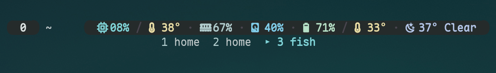

# termux-launcher-tmux

Material You tmux workflow and theme for [Termux Launcher](https://github.com/PickleHik3/termux-launcher).



## Install With TPM

Install TPM first if you do not already use it:

```sh
git clone https://github.com/tmux-plugins/tpm ~/.tmux/plugins/tpm
```

Add the plugin near the bottom of `~/.tmux.conf`:

```tmux
set -g @plugin 'PickleHik3/termux-launcher-tmux'

run '~/.tmux/plugins/tpm/tpm'
```

Reload tmux, then press `prefix + I` to install plugins:

```sh
tmux source-file ~/.tmux.conf
```

## Requirements

- tmux 3.6 or newer
- a Nerd Font in Termux
- Termux Launcher Material colors at `~/.termux/material-colors.sh`
- optional helper commands on `PATH`:
  - `launcher-system-monitor`
  - `launcher-weather-widget`
  - `kew-tmux-status`
  - `kew-now-playing`

The helper commands are documented in the Termux Launcher [tmux status setup](https://github.com/PickleHik3/termux-launcher/blob/dev/docs/en/Launcher_Tmux_Status_Setup.md).

## User Options

Set any of these before the TPM line in `~/.tmux.conf`, then reload tmux.

```tmux
# Defaults are all "on".
set -g @termux-launcher-tmux-system-widgets on
set -g @termux-launcher-tmux-weather on
set -g @termux-launcher-tmux-kew-status on
set -g @termux-launcher-tmux-now-playing on

# Extra resource widgets default to "off".
set -g @termux-launcher-tmux-storage-widget off
set -g @termux-launcher-tmux-battery-widget off
set -g @termux-launcher-tmux-network-widget off
set -g @termux-launcher-tmux-cpu-temperature-widget off
set -g @termux-launcher-tmux-battery-temperature-widget off
```

Turn widgets off individually:

```tmux
set -g @termux-launcher-tmux-system-widgets off
set -g @termux-launcher-tmux-weather off
set -g @termux-launcher-tmux-kew-status off
set -g @termux-launcher-tmux-now-playing off
```

Turn extra resource widgets on individually:

```tmux
set -g @termux-launcher-tmux-storage-widget on
set -g @termux-launcher-tmux-battery-widget on
set -g @termux-launcher-tmux-network-widget on
set -g @termux-launcher-tmux-cpu-temperature-widget on
set -g @termux-launcher-tmux-battery-temperature-widget on
```

The extra widgets read `launcherctl resources`. The network widget needs the `network` array from that endpoint; if the backend does not expose it on a device, the widget stays blank.

## Controls

| Key | Action |
| --- | --- |
| `C-Space` | tmux prefix |
| `C-b` | fallback prefix |
| `Alt+e` | show keybind reference popup |
| `prefix q` | reload `~/.tmux.conf` |
| `F12` | run `termux-reload-settings` |
| `prefix h` / `prefix v` | split pane below / right |
| `prefix x` | kill pane |
| `C-M-Arrow` | select pane |
| `C-M-S-Arrow` | resize pane |
| `M-1` ... `M-9` | select window |
| `M-Left` / `M-Right` | previous / next window |
| `M-S-Left` / `M-S-Right` | move current window |
| touch/click a window name | select that window |
| `prefix c` / `prefix k` | new / kill window |
| `prefix r` | rename window |
| `M-Up` / `M-Down` | previous / next session |
| `prefix C` / `prefix K` | new / kill session |
| copy mode `v` / `y` | start selection / copy selection |

## App Shortcut Examples

The plugin does not install app-launch shortcuts by default. Add only the shortcuts you want to your own `~/.tmux.conf`:

```tmux
bind -n M-w run-shell 'tmux display-message "Opening WhatsApp"; launcherctl launch whatsapp >/dev/null 2>&1 || tmux display-message "Launch failed: WhatsApp"'
bind -n M-y run-shell 'tmux display-message "Opening YouTube"; launcherctl launch youtube >/dev/null 2>&1 || tmux display-message "Launch failed: YouTube"'
bind -n M-b run-shell 'tmux display-message "Opening Browser"; launcherctl launch cromite >/dev/null 2>&1 || tmux display-message "Launch failed: Browser"'
```

Change the app ids to match your `launcherctl apps` output.

## What It Does

- Installs the Termux Launcher tmux keybinds and options: prefix, pane/window/session navigation, copy-mode keys, help popup, and `F12` settings reload.
- Uses Termux Launcher's Material color exports.
- Shows a compact two-row tmux status bar for Android screens.
- Shows `PRFX` and `COPY` state pills on the left.
- Shows the current directory as a muted `~/...` path.
- Shows CPU, RAM, and weather in a rounded right-side pill.
- Can optionally add storage, battery, network, CPU temperature, and battery temperature widgets.
- Shows windows on the second row, with the focused window showing the active process name.
- Shows `kew-now-playing` on the far right of the second row when it has content.
