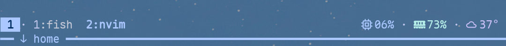

# termux-launcher-tmux

Material You tmux workflow and theme for [Termux Launcher](https://github.com/PickleHik3/termux-launcher).

| Rounded | Sleek |
| --- | --- |
|  |  |

## Install With TPM

Install TPM first if you do not already use it:

```sh
git clone https://github.com/tmux-plugins/tpm ~/.tmux/plugins/tpm
```

Add the plugin near the bottom of `~/.tmux.conf`:

```tmux
set -g @plugin 'PickleHik3/termux-launcher-tmux'

run '~/.tmux/plugins/tpm/tpm'
```

Reload tmux, then press `prefix + I` to install plugins:

```sh
tmux source-file ~/.tmux.conf
```

## Requirements

- tmux 3.6 or newer
- a Nerd Font in Termux
- Termux Launcher Material colors at `~/.termux/material-colors.sh` or `~/.termux/material-colors.properties`
- optional helper commands on `PATH`:
  - `launcher-system-monitor`
  - `launcher-weather-widget`
  - `kew-now-playing`

The helper commands are documented in the Termux Launcher [tmux status setup](https://github.com/PickleHik3/termux-launcher/blob/dev/docs/en/Launcher_Tmux_Status_Setup.md).

## User Options

Set any of these before the TPM line in `~/.tmux.conf`, then reload tmux.

```tmux
# Theme defaults to "rounded". Use "sleek" for the smux-inspired minimal bar.
set -g @termux-launcher-tmux-theme rounded

# Core widgets default to "on".
set -g @termux-launcher-tmux-system-widgets on
set -g @termux-launcher-tmux-weather on
set -g @termux-launcher-tmux-now-playing on

# Weather display: compact shows "󰖔 37°"; condition shows "󰖔 37° Sunny".
set -g @termux-launcher-tmux-weather-mode compact

# Extra resource widgets default to "off".
set -g @termux-launcher-tmux-storage-widget off
set -g @termux-launcher-tmux-battery-widget off
set -g @termux-launcher-tmux-cpu-temperature-widget off
set -g @termux-launcher-tmux-battery-temperature-widget off
```

Turn widgets off individually:

```tmux
set -g @termux-launcher-tmux-system-widgets off
set -g @termux-launcher-tmux-weather off
set -g @termux-launcher-tmux-now-playing off
```

Switch to the smux-inspired theme:

```tmux
set -g @termux-launcher-tmux-theme sleek
```

Show the weather condition text:

```tmux
set -g @termux-launcher-tmux-weather-mode condition
```

Turn extra resource widgets on individually:

```tmux
set -g @termux-launcher-tmux-storage-widget on
set -g @termux-launcher-tmux-battery-widget on
set -g @termux-launcher-tmux-cpu-temperature-widget on
set -g @termux-launcher-tmux-battery-temperature-widget on
```

The extra widgets read `launcherctl resources`.

## Themes

### Rounded

`rounded` is the default Material You theme. It uses a compact two-row status bar with elevated chips for session, prefix, copy mode, system widgets, weather, and now playing.

### Sleek

`sleek` is inspired by smux. It uses one top status row plus a labeled pane-border row:

- the session widget is a solid Material-colored chip
- windows show the active pane command, such as `1:fish`, instead of repeating the current path
- CPU, RAM, weather, optional resource widgets, zoom, and now playing stay on the top-right as colored text without chip backgrounds
- the pane-border label shows the current pane path/name in normal mode, `PRFX` in prefix mode, and `COPY` in copy mode
- active windows, borders, prefix/copy indicators, widgets, copy mode, and messages use Material color roles from the current wallpaper

The theme option is global:

```tmux
set -g @termux-launcher-tmux-theme sleek
```

## Controls

The default prefix is `Ctrl+Space`. `Ctrl+b` is also available as a fallback.

### Help And Reload

| Key | Action |
| --- | --- |
| `Alt+e` | Show the keybind reference popup |
| `prefix q` | Reload `~/.tmux.conf` |
| `F12` | Reload Termux settings with `termux-reload-settings` |

### Panes

| Key | Action |
| --- | --- |
| `prefix h` | Split below, starting in the current pane path |
| `prefix v` | Split right, starting in the current pane path |
| `prefix x` | Kill the current pane |
| `Ctrl+Alt+Arrow` | Move focus between panes |
| `Ctrl+Alt+Shift+Arrow` | Resize the current pane |

### Windows

| Key | Action |
| --- | --- |
| `prefix c` | Create a new window in the current pane path |
| `prefix k` | Kill the current window |
| `prefix r` | Rename the current window |
| `Alt+1` ... `Alt+9` | Jump to window 1 through 9 |
| `Alt+Left` / `Alt+Right` | Previous / next window |
| `Alt+Shift+Left` / `Alt+Shift+Right` | Move the current window left / right |
| Touch/click a window name | Select that window |

### Sessions

| Key | Action |
| --- | --- |
| `prefix Shift+c` | Create a new session in the current pane path |
| `prefix Shift+r` | Rename the current session |
| `prefix Shift+k` | Kill the current session |
| `Alt+Up` / `Alt+Down` | Previous / next session |
| `prefix Shift+p` / `prefix Shift+n` | Previous / next session |

Unnamed sessions are normalized to numeric names starting at `1`. A named autostart session such as `main` can coexist with `1`, `2`, and later numeric sessions.

### Copy Mode

| Key | Action |
| --- | --- |
| `prefix [` | Enter copy mode |
| `v` | Start selection |
| `y` | Copy selection and leave copy mode |

## App Shortcut Examples

The plugin does not install app-launch shortcuts by default. Add only the shortcuts you want to your own `~/.tmux.conf`. In tmux config syntax, `M-` means `Alt+`.

```tmux
bind -n M-w run-shell 'tmux display-message "Opening WhatsApp"; launcherctl launch whatsapp >/dev/null 2>&1 || tmux display-message "Launch failed: WhatsApp"'
bind -n M-y run-shell 'tmux display-message "Opening YouTube"; launcherctl launch youtube >/dev/null 2>&1 || tmux display-message "Launch failed: YouTube"'
bind -n M-b run-shell 'tmux display-message "Opening Browser"; launcherctl launch cromite >/dev/null 2>&1 || tmux display-message "Launch failed: Browser"'
```

Change the app ids to match your `launcherctl apps` output.

## What It Does

- Installs the Termux Launcher tmux keybinds and options: prefix, pane/window/session navigation, copy-mode keys, help popup, and `F12` settings reload.
- Uses Termux Launcher's Material color exports and maps them to Material-style roles: neutral surfaces for structure, primary for focus, secondary/tertiary for supporting signal, and error only for alerts.
- Defaults to the `rounded` theme, a compact two-row tmux status bar for Android screens.
- Provides a `sleek` theme inspired by smux: one top status row plus a labeled pane-border row, default terminal background, command-based window labels, a solid Material session chip, and Material-colored text widgets without chip backgrounds.
- In `rounded`, shows session, prefix, and copy mode as elevated Material-style chips on the left.
- Shows CPU, RAM, optional resource widgets, zoom state, and compact or condition weather in the active theme style.
- Can optionally add storage, battery, CPU temperature, and battery temperature widgets.
- Shows windows in the theme layout, with `sleek` using command-based labels such as `1:fish`.
- Normalizes unnamed sessions to `1`, `2`, and so on while preserving named sessions such as `main`.
- Shows the current `kew` track in the active theme status area only while playback is active.
